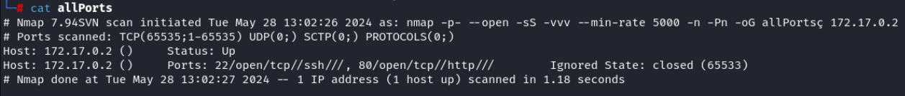
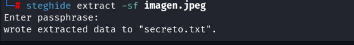
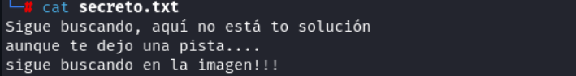
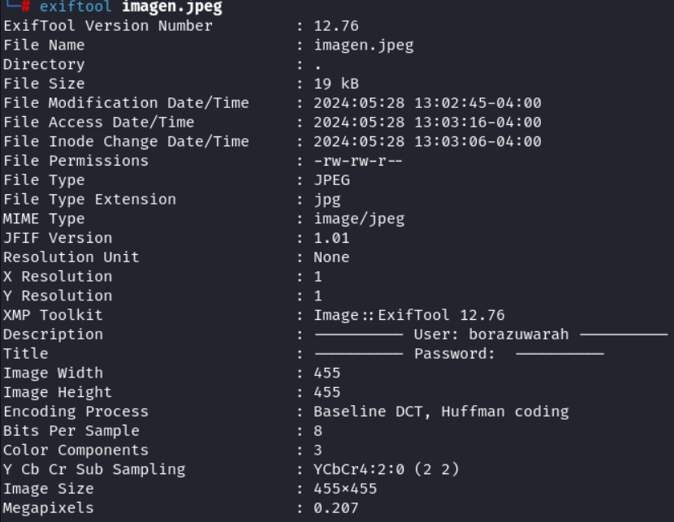
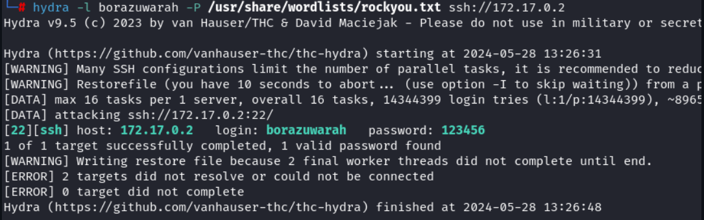
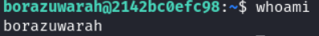
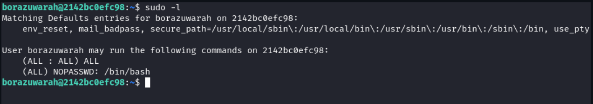
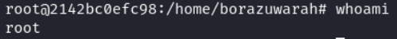

# BorazuwarahCTF
Vulnerable Machine
https://dockerlabs.es/ (Muy facil).

### Herramientas usadas.

-- Despliegue:

    auto_deploy.sh: Script personalizado para levantar la máquina vulnerable desde un archivo '.tar'.

    chmod: Cambia permisos de archivos, necesario para hacer ejecutable el script.

-- Reconocimiento:

    ping: Verifica conectividad hacia una IP.

    nmap: Escaneo de puertos abiertos y servicios.

-- Análisis web/Esteganografia:

    Navegador web: Para acceder a la página en el puerto 80.

    steghide: Herramienta de esteganografia para extraer datos ocultos de imágenes.

    exiftool: Visualiza metadatos ocultos en archivos multimedia (Usado en imagen JPEG.).

-- Ataque de fuerza bruta:

    hydra: Herramienta de fuerza bruta para romper contraseñas (Usada contra SSH).

    rockyou.txt: Diccionario comúnmente usado en ataques de fuerza bruta.

-- Acceso al sistema:

    ssh: Cliente para conectarse remotamente por el protocolo 'SSH'.

-- Escalada de privilegios:

    sudo: Permite ejecutar comandos como otro usuario ('root' en este caso).

    whoami: Confirma el usuario actual con el que se está trabajando.

### Despliegue.

    ./auto_deploy.sh borazuwarahctf.tar

    -- Antes dar permisos con 'chmod +x'

### Reconocimiento.  

    ping -c 1 172.17.0.2

    ping : herramienta de red que se usa para verificar si una dirección IP está accesible, envia paquetes 
    ICMP(Internet Control Message Protocol) y espera respuesta.

    -c 1 : Significa que enviara 'solo 1 paquete' (por defecto 'ping' sigue enviando paquetes hasta que lo detienes con Ctrl + C).

    172.17.0.2 : Dirección IP del destino al que se le está haciendo 'ping', la IP es tipo Docker porque '172.17.0.x' es tipico en redes de contenedores.

### Reconocimiento con Nmap.

    nmap -p- --open --min-rate 5000 -sS -vvv -n -Pn 172.17.0.2 -oG allPorts

    -p- : Aplica reconocimiento a todos los puertos.

    --open : Solo a los que estan abiertos.

    --min-rate 5000 : Le dice a 'nmap' que no baje de 5000 paquetes por segundo, lo qeu acelera el escaneo.

    -sS : Escaneo rapido y silencioso.

    -vvv : Conforme encuentra un puerto, lo muestra por pantalla.

    -n : No aplica resolución DNS, solo trabaja con direcciónes IP.

    -Pn : Ignora si esta activa o no la IP, asi la escanea igual.

    172.17.0.2 : IP objetivo.

    -oG allPorts : Se exporta el resultado en formato 'grepable' o 'grepable output', este formato esta diseñado para ser facilmente procesado por herramientas o scripts, los resultados se guardan en 'allPorts'.

-- Para ver los resultados del archivo grepeable hacemos cat 'allPorts'.

### Pagina web (Puerto 80).

    Al ir al sitio web 'Poniendo la dirección IP en el navegador', se observa solo una imagen, proceso a descargarla para luego analizarla.

### Estenografia.

    -- Es el arte y técnica de acultar información dentro de otra cosa, de forma que nadie se dé cuenta de 
    que hay algo escondido.

    steghide extract -sf imagen.jpeg

    steghide : Llama a la herramienta

    extract : Le indicas que quieres extraer los datos ocultos.

    -sf imagen.jpeg : Especifica el archivo de entrada, donde '-sf' significa 'stego file', es decir, el 
    archivo que podria tener algo escondido.

-- Nos pedirá una passphrase, como no la tengo le doy enter, y vemos que realmente si habia un archivo 
oculto llamado 'secreto.txt'.

-- Vemos el contenido del archivo:

    cat secreto.txt

-- Busqueda de mas información dentro de la imagen:

    exiftool imagen.jpeg

    exiftool : Es una herramienta súper poderosa para ver, editar y eliminar 'metadatos' de archivos 
    multimedia (imágenes, videos, PDFs, audios, etc).

-- Se observa el nombre de usuario llamado: 'borazuwarah'.

### HYDRA

    -- Un vez conocido el posible usuario, se aplica un ataque de fuerza bruta al puerto 22 (ssh) con 'hydra':

    hydra -l borazuwarah -P /usr/share/wordlists/rockyou.txt ssh://172.17.0.2

    hydra : Llama a la herramienta.

    -l borazuwarah : Especifica el nombre de usuario que se va a usar durante el ataque.

    -P : Especifica una lista de contraseñas.

    /usr/share/wordlists/rockyou.txt : Ruta del archivo donde esta la lista de contraseñas.

    ssh://172.17.0.2 : Se intenta el logueo por 'SSH' a 172.17.0.2 usando el usuario 'borazuwarah', 
    y prueba todas las contraseñas del archivo 'rockyou.txt'.

### SSH (Puerto 22)

 -- Al tener ya el usuario y contraseña, probamos el autenticarnos al servicio 'SSH':

    ssh borazuwarah@172.17.0.2

    -- Luego la contraseña: 123456

-- Ya somos el usuario 'borazuwarah'.

### Escala de privilegios.

    sudo -l

    -l : Lista los comandos que podemos ejecutar como 'sudo'.

-- Se observa que se puede ejecutar /bin/bash.

    sudo -u root /bin/bash

    sudo : Ejecuta un comando con privilegios elevados.

    -u root : Especifica que el comando debe ejecutarse como el usuario 'root'.

    /bin/bash : Es el comando que quieres ejecutar, en este caso, lanzar una nueva shell.

    -- Nos permite ejecutar la 'bash' como root sin proporcionar contraseña.

-- Con el comando 'whoami', vemos que ya somos 'root'.

